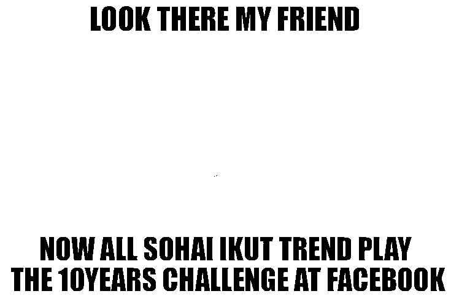

### **Extract text from the images by yourself. Do not use the already provided 'text' column.**

In this exercise, I tried several ways to extract texts from memes. First, I went to use transformers, which I knew offered the easiest solutions in most cases, but the initial attempts to extract the text were unsuccessful. Then I tried to make it easier for the model by using OpenCV and removing the background. As you can see below, the first part has progressed well, but the output of the text was still not very satisfactory. I started searching again and fortunately managed to find a library that has both reliable outputs and can use GPU. I have to thank [EasyOCR](https://github.com/JaidedAI/EasyOCR "EasyOCR") :)

**In the BERT.ipynb:**
1. Downloading the dataset 
2. Discarding unusable samples
3. Extracting text from memes
4. Using BERT tokenizer
5. Building a simple model
	- Bert as a sentence embedder
	- classifiers layer
6. Simple model training
